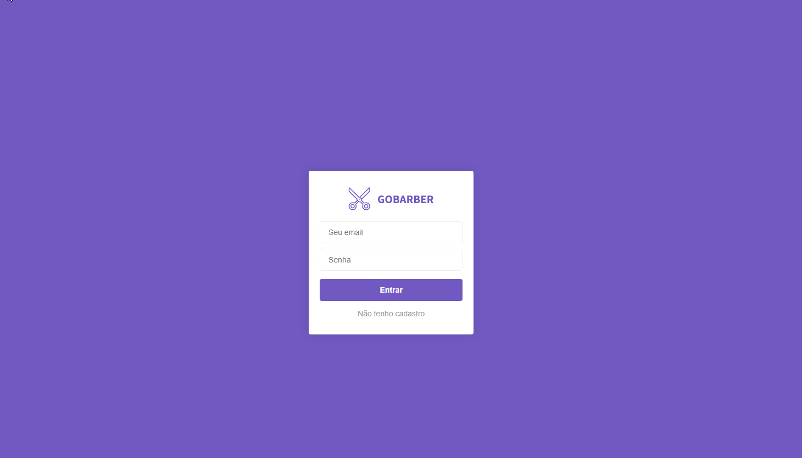

## How can I run it?

Clone the project. Rename the file **.env.sample** to **.env** and fill it with your own database informations.
In the project directory, you can run:

### `npm install`

or

### `yarn install`

and than run the [sequelize](https://sequelize.org/master/manual/migrations.html) migration to get all the tables:

### `sequelize db:migrate`

at last you should run:

### `npm dev`

or

### `yarn dev`

open your browser at [localhot:3000](http://localhost:3000) to see the application.

Than you will get this:

